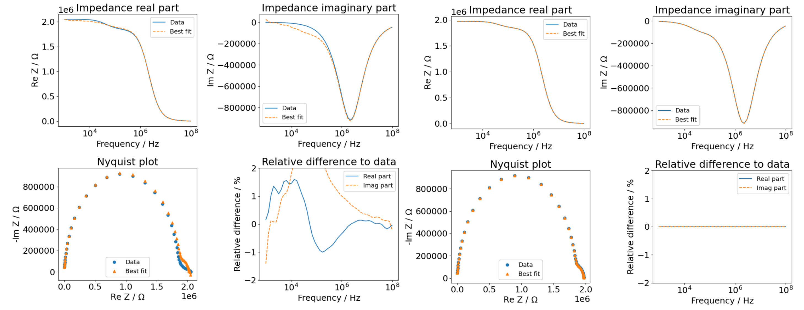
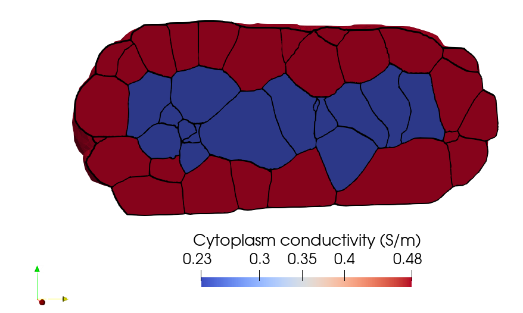

# Numerical simulations of electrical stimulation of large 3D multicellular systems

This code repository is meant to enable researchers to run numerical simulations of the electrical stimulation of systems comprising thousands of cells.
The numerical solver relies on [NGSolve](https://ngsolve.org/).
In the following, we will describe how to install NGSolve and run the simulations.

If you encounter any problems installing NGSolve, please post to the official [NGSolve forum](https://forum.ngsolve.org/).
If you encounter problems running the scripts posted here, please use the GitHub issue tracker and tag [Vien](https://github.com/CheLamVien) or [Julius](https://github.com/j-zimmermann).

## Quickstart

1. How does it work?
   
	We simulate the electric field in sub-domains that are connected by a thin layer.
	We focused on biological cells, where the thin layer is the cell membrane.
	The code supports thousands of sub-domains (cells) that can be multiply connected.
	The code runs on HPC clusters and supports MPI.

1. What type of input data do we support?
   1. CAD files: if you have a labelled CAD file of your data or a parametrised CAD model, please start with Netgen/NGSolve and the OpenCascade interface. Create a Netgen mesh that labels all cells and all interfaces directly from the CAD file. An example of this approach can be found in the function `BuildCartilageGeometry` in `cell_simulation_utilities/src/cell_simulation_utilities/geo_bennets.py`.
   2. Voxelised data: Convert the voxelised data (e.g., fluorescence microscopy data) to a CGAL-compatible format and use CGAL to create a surface mesh. All details are in the folder `CGALMesh_3d`.
   3. Meshes: Provide a mesh that has all sub-domains and all interfaces distinctly labelled by string identifiers. We provide an example in `RealisticSimulations/SimpleTest`, check the mesh in `Sample02_093_segCell.nii_relabel.gz.vol.gz` in Netgen/NGSolve to get an idea of the data structure.
1. What else do I need to provide?

    The dielectric properties of all sub-domains and interfaces.
    The applied voltage and the frequencies at which the solution shall be computed.
   
1. What can I compute?
	1. The 3D electric potential: This is the numerical solution of the underlying electroquasistatic field equation (visualizable in ParaView).
 	2. The 3D electric field: This is the negative gradient of the potential (visualizable in ParaView).
  	3. The induced transmembrane potential (iTMP): This is the difference between the potential on the inside and the outside of the cell membrane (visualizable in ParaView).
    4. The impedance: This is a scalar value that is computed at each frequency. You can compute the dielectric properties of the entire multicellular system if you know the cell constant of the electrostimulation system.

## Installation 

The code requires a high-performance computing (HPC) workstation or cluster.
No administrator rights are required to install the software.

An MPI library needs to be installed.
Also, cython and gfortran need to be installed.

**CMake in a version less than CMake 4 is required.** 

Install Python (ideally version 3.10 or 3.11, up to 3.13 has been tested).
Create a new virtual environment:
* with Python 3.10:
```
virtualenv 3d_cell_venv
```
* with Python 3.11:
```
python3 -m venv 3d_cell_venv
```
```
source 3d_cell_venv/bin/activate
```
Install all required packages

```
pip install --upgrade pip
pip install mpi4py
pip install numpy
pip install scipy
pip install sympy
pip install pandas
pip install matplotlib
pip install networkx
pip install impedancefitter
pip install virtualenvwrapper
source 3d_cell_venv/bin/virtualenvwrapper.sh
```
### Simple Installation of NGSolve using pip
```
python -m pip install -i https://pypi.anaconda.org/mpi4py/simple openmpi   
python -m pip install numpy scipy matplotlib jupyter ipyparallel scikit-build
python -m pip install --upgrade ngsolve webgui_jupyter_widgets
python -m pip install --no-cache-dir "mpi4py>=4.0.0"
```

Test the installation using
```
mpiexec -n 2 python -c "from mpi4py import MPI; print (MPI.get_vendor()); c=MPI.COMM_WORLD; print ('I am', c.rank, 'out of', c.size)"
mpiexec -n 4 python -m ngsolve.demos.mpi.mpi_poisson
```

(Optional) Install PETSc

```
export PETSC_CONFIGURE_OPTIONS="--with-fc=0 --with-debugging=0 --download-hypre \
         COPTFLAGS=\"-O2\" CXXOPTFLAGS=\"-O2\" "
python -m pip install --upgrade --no-deps --force-reinstall --no-cache-dir petsc petsc4py
python -m pip install git git+https://github.com/NGSolve/ngsPETSc.git
```

### Install NGSolve from source

Installing NGSolve follows the instructions [here](https://docu.ngsolve.org/latest/install/installlinux.html).
Please make sure that all dependencies are installed!

We recommend the following steps (change the version if you want to run a more recent one):
```
version=v6.2.2402
export BASEDIR=~/ngsuite
mkdir -p $BASEDIR
cd $BASEDIR && git clone https://github.com/NGSolve/ngsolve.git ngsolve-src
cd $BASEDIR/ngsolve-src
git checkout tags/$version -b $version
git submodule update --init --recursive
mkdir $BASEDIR/ngsolve-build
mkdir $BASEDIR/ngsolve-install
cd $BASEDIR/ngsolve-build
cmake -DUSE_MPI=ON -DBUILD_OCC=ON -DUSE_OCC=ON -DUSE_GUI=OFF -DUSE_NATIVE_ARCH=ON -DCMAKE_INSTALL_PREFIX=${BASEDIR}/ngsolve-install ${BASEDIR}/ngsolve-src
make -j4
make install
echo "export NETGENDIR=${BASEDIR}/ngsolve-install/bin" >> ~/.bashrc
echo "export PATH=\$NETGENDIR:\$PATH" >> ~/.bashrc
source ~/.bashrc
export PYTHONPATH_TMP=`python3 -c "import os.path, sysconfig;print(os.path.relpath(sysconfig.get_path('platlib'), sysconfig.get_path('data')))"`
add2virtualenv $NETGENDIR/../${PYTHONPATH_TMP}
```
### Install PETSc
Download the code:
```
wget https://web.cels.anl.gov/projects/petsc/download/release-snapshots/petsc-3.23.3.tar.gz
tar xf petsc-3.23.3.tar.gz
cd petsc-3.23.3
```
Real arithmetic:
```
./configure COPTFLAGS='-O3' CXXOPTFLAGS='-O3'\
	--with-debugging=no\
        --PETSC_ARCH="real"\
        --with-fortran-bindings=0\
        --with-fortran-type-initialize=0\
        --with-shared-libraries\
        --with-mpi=1\
        --with-cxx-dialect=c++11\
        --with-metis=1\
        --with-metis-dir=~/ngsuite/ngsolve-build/dependencies/parmetis\
        --with-parmetis=1\
        --with-parmetis-dir=~/ngsuite/ngsolve-build/dependencies/parmetis\
        --with-blaslapack=1\
        --with-zlib=1\
        --with-ilu=1\
        --with-cmake=1\
        --with-superlu=1 --download-superlu=yes\
        --with-mumps=1 --download-mumps=yes --download-mumps-shared=0\
        --with-scalapack=1 --download-scalapack=yes \
	--with-petsc4py
```
Follow then the further instructions.

Complex arithmetic:
```
./configure COPTFLAGS='-O3' CXXOPTFLAGS='-O3'\
	--with-debugging=no \
        --PETSC_ARCH="complex" \
        --with-scalar-type=complex \
        --with-fortran-bindings=0 \
        --with-fortran-type-initialize=0 Despite the advances made by these methods, they often still underperform due to the low signal-to-noise ratios and dense packing of nuclei in typical fluorescence microscopy datasets. In particular, methods of category 1) are prone to erroneously fuse touching nuclei, and those of category 2) may fail to discern objects that are poorly approximated with bounding boxes.
        --with-shared-libraries \
        --with-mpi=1 \
        --with-cxx-dialect=c++11 \
        --with-metis=1 \
        --with-metis-dir=~/ngsuite/ngsolve-build/dependencies/parmetis \
        --with-parmetis=1 \
        --with-parmetis-dir=~/ngsuite/ngsolve-build/dependencies/parmetis \
        --with-blaslapack=1 \
        --with-zlib=1 \
        --with-ilu=1 \
        --with-cmake=1 \
        --with-superlu=1 --download-superlu=yes \
        --with-mumps=1 --download-mumps=yes --download-mumps-shared=0 \
        --with-scalapack=1 --download-scalapack=yes \
	--with-petsc4py
```
Follow then the instructions.

CUDA can be enabled by adding the flag `--with-cuda`.
Then, use `real-cuda` or `complex-cuda` as `PETSC_ARCH`.

Set the `PETSC_DIR`:
```
echo "export PETSC_DIR=~/petsc-3.23.3" >> ~/.bashrc
source ~/.bashrc
```

To use PETSc, set the `PETSC_ARCH` to `real` or `complex` when running the script 
(depending on the application).

Use petsc4py: every time the PYTHONPATH needs to be added:
```
export PYTHONPATH=$PYTHONPATH:$PETSC_DIR/$PETSC_ARCH/lib
```

Install the NGSolve-to-PETSc package (ngsPETSc)
```
cd ~/ngsuite
git clone https://github.com/UZerbinati/ngsPETSc.git
cd ngsPETSc
NGSPETSC_NO_INSTALL_REQUIRED=ON pip install .
```

## Simulations

Finally, install our helper package
```
cd cell_simulation_utilities
pip install .
```

If you want to change the code, please install using
```
pip install -e . 
```

**A limitation is that mesh refinement requires a re-definition
of the function space because we use `CompressCompound` to 
remove unused DOFs from the function space.
Refining a mesh linked to a function space leads to a segfault.**


### Verification and Validation

If you want to check the compiled code, please compare against
the verification and validation test cases presented in
the following folders. In each folder, there is a `benchmark` folder.
If your local results deviate significantly from them, your installation
might be broken. Try to recompile and otherwise open an issue
with a detailed bug report.

1. 2D example (little computational effort): Please navigate to `ValidationSimulations/ConvergenceRates/2DAnalytical`.

1. 3D example (requires powerful workstation): Please navigate to `ValidationSimulations/ConvergenceRates/3DAnalytical`.

1. Impedance spectra (requires powerful workstation): Please navigate to `ValidationSimulations/ImpedanceSpectra/36cells`.

1. LinKK test (requires powerful workstation): Please navigate to `ValidationSimulations/LinKKTest`.

The Lin-KK test can be used to check the correctness of impedance data in accordance with the Kramers-Kronig relations [1].
[1]. M. Schönleber, D. Klotz, E. Ivers-Tiffee, A Method for Improving the Robustness of linear Kramers-Kronig Validity Tests, Electrochim. Acta 131 (2014) 20–27. doi:10.1016/j.electacta.2014.01.034.


For instance, it can detect incorrect impedance results caused by solver non-convergence when error tolerance increases (from left to right).



When we deliberately omitted the impedance contribution of the cell membrane, the Lin-KK test correctly detected this mistake (left: impedance without cell membrane contribution, right: impedance with cell membrane contribution).

### Realistic 3D geometries

To reproduce the results presented in the paper, please refer to the following folders:

1. **Data and Mesh Creation**  
   Navigate to: `CGALMesh_3D/FluorescenceMicroscopyData`  
   This folder contains all information related to data preparation and mesh generation.

2. **Solver with Generated Meshes**  
   Navigate to: `RealisticSimulations/SimulationPaper`  
   This folder contains the solver setup and simulations performed using the generated meshes.



Using a multi-domain mesh, one can assign different material properties to different cells. For example, the outer and inner parts of the embryos have distinct conductivities.

Time-lapse visualisations of induced transmembrane potential and electric field dynamics of the ASTEC dataset at the different developmental stages can be found at `RealisticSimulations/ASTECResultsTimeLapse`
